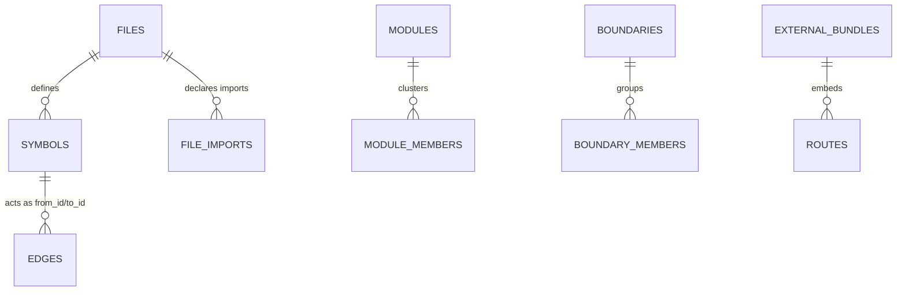
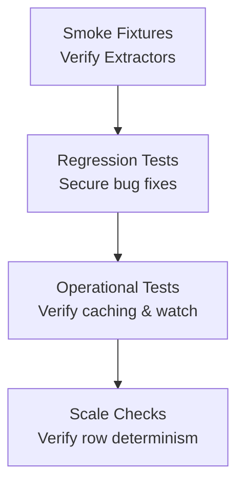

# Seer — Developer & Implementation Guide

This document is the implementation-level companion to [seer-master-guide.md](seer-master-guide.md). It outlines what has been built, the environment setup, the local project architecture, key technical decisions, and the testing/scaling benchmarks.

For agent-facing usage and MCP commands, refer to the compact reference card at [seer-cli-docs.md](seer-cli-docs.md).
To extend language parsing, refer to the checklist in [adding-new-languages.md](adding-new-languages.md).

---

## 1. Environment & Technical Stack

| Category | Technology | Rationale |
|----------|------------|-----------|
| **Runtime** | Node.js 26+ | Fast local script execution and standard worker thread support. |
| **Language** | TypeScript (CommonJS output) | High type-safety for complex graph structures; CommonJS maps to standard Node tools. |
| **Database** | Synchronous `node:sqlite` (built-in) | Zero native npm dependencies; bypasses the compiler traps of native libraries on Node 26. |
| **Parser** | `web-tree-sitter` (WASM) | Fast Tree-Sitter AST parsing in V8 without native C++ compilation. |
| **Grammars** | `tree-sitter-wasms` | Pre-compiled WASM grammars for 8 supported languages loaded lazily. |

---

## 2. Quick Start

```bash
# Install dependencies
npm install

# Transpile TypeScript to dist/
npm run build

# Index a target workspace
node dist/cli/index.js index /path/to/repo

# Query top symbols by PageRank
node dist/cli/index.js symbols --top 20

# Run the Model Context Protocol (MCP) server
node dist/cli/index.js mcp --workspace /path/to/repo

# Run all automated tests (smoke, parallel index, regressions, git, etc.)
npm test

# Run the large-codebase scale suite ( Helix, client-go, React, Godot, Linux, Unreal, etc.)
npm run scale-test

# Run the serial-vs-parallel row parity gate
npm run test:scale-parallel-parity
```

---

## 3. Project Directory Map

```text
src/
  types.ts                    Core shared types (SymbolDef, SymbolRef, SymbolRow, etc.)
  db/
    schema.ts                 Idempotent DDL migrations + CURRENT_SCHEMA_VERSION (v10).
    store.ts                  Database wrapper (transactions, read-only opens, indexers).
  parser/
    parserContext.ts          Isolate WASM parser, grammar registry, and query cache.
    walker.ts                 AST walker and LanguageExtractor interface.
    worker.ts                 Thread worker implementation for parser pooling.
    workerpool.ts             Parser worker thread pool (crash respawning, lag buffer).
    languages/                Language extractors (Python, TS/JS, Go, Java, Rust, C/C++, C#).
  indexer/
    discovery.ts              File discovery with .gitignore & .seerignore logic.
    classify.ts               File classification mapping roles (project, vendor, test, generated).
    index.ts                  Indexer engine: orchestrates parsing, caching, and post-passes.
    skeleton.ts               Structural skeleton renderer: signature preservation, body elision, focusSymbol.
    modules.ts                Louvain modular clustering over weighted graph edges.
    behavior.ts               Ranked tests-as-behavioral-spec engine.
    risk.ts                   Decomposed deterministic edit-risk scoring.
    context.ts                One-call compact pre-edit context packets.
    freshness.ts              JIT sync checking dirty file hashes before MCP queries.
    watcher.ts                Chokidar file watcher mapping background updates.
    boundaries.ts             Monorepo package boundary identification.
    continuity.ts             Rename and cross-file move tracking engine.
  bundle/
    format.ts / ci.ts         .seerbundle layout and reproducible CI bundle utilities.
    export.ts / import.ts     Bundle archive serialization, db vacuuming, and extraction.
    contract.ts               Protocol-aware API contract diff engine.
  scip/                       JSON SCIP precision overlay imports.
  mcp/
    server.ts                 MCP stdio server mapping JIT and watch cycles to 42+ tools.
  cli/
    index.ts                  Commander CLI endpoint mapping all query and setup verbs.
```

---

## 4. Technical Foundations

### 1. Database Schema (v10)
Seer uses a single `.seer/graph.db` SQLite database with **CURRENT_SCHEMA_VERSION = 10**. Migrations are fully idempotent and run automatically on writer opens using `ALTER TABLE ADD COLUMN` or `CREATE TABLE IF NOT EXISTS` checks.



#### Core Database Table Blueprint:
*   **`_schema_meta`**: Tracks database metadata and schema integer version.
*   **`files`**: Paths, sizes, content hashes, languages, and structural role classifications (`'project' | 'vendor' | 'generated' | 'test'`).
*   **`symbols`**: Definition nodes carrying short `name`, qualified context-aware `qualified_name`, lexical bounds, `symbol_role` (`'definition' | 'declaration' | 'type_ref'`), and `is_rankable` flags.
*   **`edges`**: Directed caller-callee call and import relationships tracking resolved target symbol IDs (`to_id`).
*   **`file_imports`**: Syntactic import paths mapped to actual indexed files during post-processing.
*   **`routes`**: Web framework API handlers (Express, Spring, tRPC, gRPC, MQ, etc.) with protocol, methods, and paths.
*   **`external_dependencies`**: Manifest-declared packages (npm, cargo, poetry) mapping global dependency edges.
*   **`config_keys`**: Config or environment variables read by symbols.
*   **`modules` / `module_members` / `module_edges`**: Louvain clustering entities of modular file graphs.
*   **`scip_imports`**: Precision overlays mapping provenance back to compiler sources.
*   **`service_calls` / `service_links`**: Outbound network requests mapped to concrete routes.
*   **`external_bundles`**: Read-only layers imported from third-party services representing API boundaries.
*   **`boundaries` / `boundary_members` / `boundary_edges`**: Monorepo package partitions and their crossings.
*   **`symbol_history_continuity`**: Resolved rename/move historical linkages.

---

### 2. Incremental Caching & Lazy PageRank
*   **Per-File Content Hashing:** Seer records file content SHA-256 hashes. If a file is unchanged, parsing is completely skipped. Old definitions are maintained, and foreign keys cascade deletes cleanly when files *do* change.
*   **Lazy PageRank:** PageRank computation runs over rankable symbols (functions, methods, classes) only. If no graph changes occurred (no files indexed, no new edge links, no file deletions), PageRank recomputation is skipped entirely, saving substantial time on large workspaces.

---

### 3. Parser Worker Pooling
WASM parsers in `web-tree-sitter` share one single V8 isolate runtime, which blocks standard Promise concurrency. To solve CPU bottlenecks:
*   Seer utilizes a `WorkerPool` of native `worker_threads`.
*   Each worker has an isolated WASM heap and `ParserContext` for reading, hashing, and parsing.
*   The main thread handles all SQLite transactions sequentially in input order to keep `AUTOINCREMENT` IDs perfectly deterministic.
*   *JIT freshness syncs* remain serial to bypass thread overhead on tiny delta edits.

---

### 4. Scope-Aware Edge Resolution
Resolving a callee symbol (`to_name`) to a target definition ID (`to_id`) uses a strict, three-pass post-index linking strategy. Passes only resolve remaining NULL links, ensuring the most narrow scope wins:
1.  **Same-File:** Matches a callee defined in the caller's own file.
2.  **Imported-File:** Scans the caller's imported files (via `file_imports`) to locate matching definitions.
3.  **Global Fallback:** Binds to a global definition of the matching name (used only when scope cannot resolve the target).

---

### 5. Monorepo Boundaries & Risk Signals
Monorepo borders are parsed from standard package files (`package.json`, `go.mod`, etc.). When a call edge originates in boundary A but resolves to a symbol in boundary B, it is recorded as a **Boundary Crossing**. These crossings are integrated directly into the `boundaryCrossings` risk profile within `seer_risk` and context packs.

---

### 6. Rename/Move Continuity
For accurate per-symbol history, Seer traces symbol refactoring:
*   **Exact Shape matching:** Uses a 64-bit SimHash over identifier-folded AST subtrees.
*   **Heuristic Matching:** Compares Hamming distance and scope similarity.
*   **Ambiguity Guards:** Common shapes (e.g. standard getters) with multiple matches are restricted to low confidence, requiring name or scope corroboration to prevent false-positives.

---

## 5. Large Codebase Scale Benchmarks

The automated scale runner (`npm run scale-test`) validates Seer against 8 large open-source repositories to assert database integrity, execution speeds, and consistency invariants.

### Measured Scale Matrix:
*   **Helix (Rust):** ~240 files | ~5,000 symbols | ~24,000 edges
*   **client-go (Go):** ~2,300 files | ~17,500 symbols | ~41,000 edges
*   **React (TS/JS):** ~4,300 files | ~20,500 symbols | ~48,000 edges
*   **Godot (C++/C#/Java):** ~4,200 files | ~134,000 symbols | ~541,000 edges
*   **Linux (C/C++):** ~63,000 files | ~1,000,000 symbols | ~4,380,000 edges
*   **TypeScript-main (TS):** ~39,000 files | ~133,000 symbols | ~118,000 edges
*   **Unreal Engine (C++):** ~84,000 files | ~1,540,000 symbols | ~5,028,000 edges
*   **Codebase-Memory (C/TS):** ~440 files | ~3,600 symbols | ~49,500 edges

### Default Exclude Strategy:
By default, file discovery excludes:
*   **Dependencies:** `node_modules/`, `vendor/`, `third_party/`, etc.
*   **Build Artifacts:** `dist/`, `build/`, `target/`, `obj/`, `.next/`, `__pycache__/`, etc.
*   **Generated Files:** `*.pb.go`, `*.generated.h`, `package-lock.json`, etc.
*   All patterns matching `.gitignore` or `.seerignore` layers.

---

## 6. Testing Strategy

Seer maintains a zero-regression policy validated across four key testing layers:



1.  **Smoke Fixtures (`tests/smoke.ts`):** Validates AST extractors, qualified names, and basic call resolution across 15+ micro-fixtures for Python, TSX, Rust, Go, C/C++, Java, and C#.
2.  **Regression Suites (`tests/bug-regressions.ts`):** Hardens Seer against prior gaps including migration locks, Spring request mapping, Fastify object parsing, Fastify prefixes, and overload sibling ID counts.
3.  **Operational Tests (`tests/mcp-jit.ts`, `tests/mcp-watcher.ts`):** Validates background watch processes, transaction batch boundaries, JIT dirty sync delays, and read-only opens.
4.  **Scale Invariants (`tests/scale-test.ts`):** Enforces that immediate cached re-runs yield row-identical symbols, edges, and PageRank weights as their fresh database indexes.
5.  **MCP Optimization Spec (`tests/optspec.ts`):** Asserts 35 distinct constraints validating token-budget list prefix-trimming, did-you-mean search suggestions on zero-result queries, deterministic skeleton body folding, batch nesting refusal, and umbrella trace routing.
